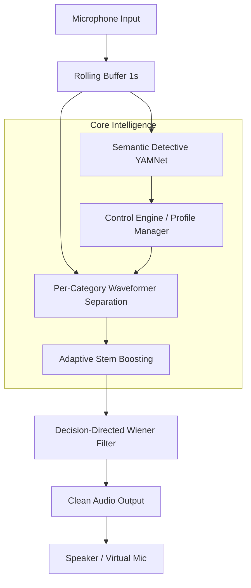

# Architecture Overview

The Semantic Noise Mixer is built on the principle of **Semantic Contextual Suppression**. Unlike traditional noise gates that filter by volume or frequency alone, this system understands *what* it is hearing before deciding *how* to process it.

## System Components

## Key Principles

### 1. Inverse Separation
The project does not try to extract "clean speech" directly. Instead, it extracts the **unwanted noise** and subtracts it from the original mixture. This "Inverse Separation" strategy preserves the quality of the desired signal (speech) much better than direct extraction, especially in low-SNR environments.

### 2. Context-Aware Suppression
By using YAMNet, the system identifies specific sound categories. This allows for:
- **User-controlled suppression**: All categories (including siren, alarm, traffic, typing, etc.) are suppressible via profiles.
- **User profiles**: Profiles like "Office" (suppress typing/appliances) vs "Commute" (suppress traffic).

### 3. Per-Category Separation with Adaptive Boosting
Each suppression category (e.g. typing, pets, traffic) receives its own Waveformer query so that loud sources don't overwhelm quiet targets in the neural network output. Queries are batched into a single GPU forward pass for efficiency. After separation, weak stems are adaptively boosted (up to 4.5×) with relaxed triggers. Under-extracted stems are scaled by up to 2×. Per-category aggressiveness overrides (typing 1.8, pets 1.6) and transient-specific STFT tuning improve suppression for typing and pets.

### 4. Real-time Decoupling
The detection logic (YAMNet) often runs at a different cadence than the separation (Waveformer). The system uses a sliding context window to ensure the deep learning models have enough temporal information for accurate inference while maintaining low perception-to-ear latency.

## Hardware & Environment
- **Desktop**: Optimized for CUDA-enabled GPUs (RTX 30 series and above). Supports `torch.compile`, ONNX Runtime acceleration, and batched multi-query inference.
- **Mobile**: Uses a specialized **Native UNet** to bypass complex-number limitations in TFLite. Supports INT8 quantization for fast on-device inference.
