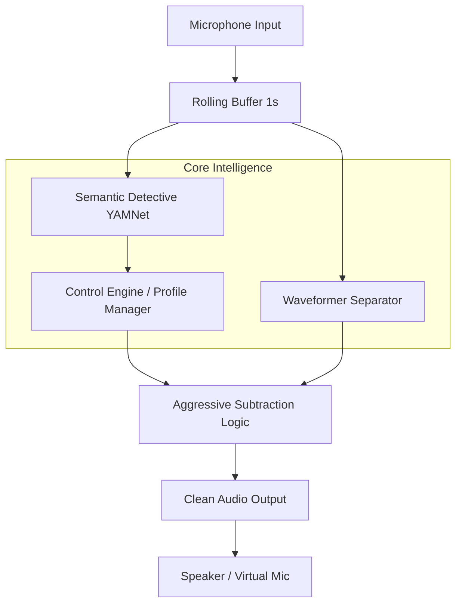

# Architecture Overview

The Semantic Noise Mixer is built on the principle of **Semantic Contextual Suppression**. Unlike traditional noise gates that filter by volume or frequency alone, this system understands *what* it is hearing before deciding *how* to process it.

## System Components

## Key Principles

### 1. Inverse Separation
The project does not try to extract "clean speech" directly. Instead, it extracts the **unwanted noise** and subtracts it from the original mixture. This "Inverse Separation" strategy preserves the quality of the desired signal (speech) much better than direct extraction, especially in low-SNR environments.

### 2. Context-Aware Suppression
By using YAMNet, the system identifies specific sound categories. This allows for:
- **Priority-based handling**: Sirens and alarms are never suppressed (Safety Override).
- **User profiles**: Profiles like "Office" (suppress typing/appliances) vs "Commute" (suppress traffic).

### 3. Real-time Decoupling
The detection logic (YAMNet) often runs at a different cadence than the separation (Waveformer). The system uses a sliding context window to ensure the deep learning models have enough temporal information for accurate inference while maintaining low perception-to-ear latency.

## Hardware & Environment
- **Desktop**: Optimized for CUDA-enabled GPUs (RTX 30 series and above).
- **Mobile**: Uses a specialized **Native UNet** to bypass complex-number limitations in TFLite.
