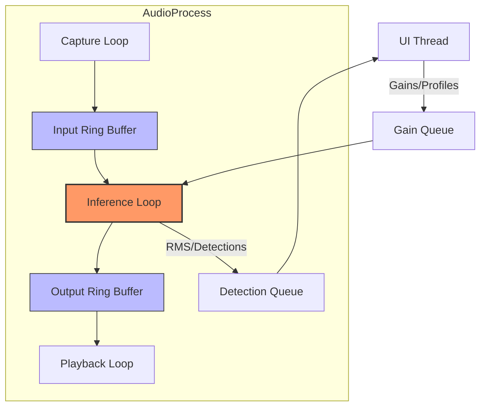

# 🎧 Desktop Audio - Intensive Documentation

> [!IMPORTANT]
> The audio module is the high-performance heart of the Semantic Noise Mixer. It is designed to bypass Python's GIL (Global Interpreter Lock) using **Multiprocessing** and **Lock-based Ring Buffers**.

---

## ⚡ Quick Reference: Methods & Heuristics

| Component | Key Method | Heuristic / Constants | Rationale |
| :--- | :--- | :--- | :--- |
| **`AudioProcess`** | `_inference_loop` | `RingBuffer(300ms)` | Decouples steady I/O from variable AI inference. |
| **`GainSmoother`** | `smooth()` | `Factor: 0.9, Floor: 0.1` | Prevents "zipper noise" and "watery" artifacts (via noise floor). |
| **`RingBuffer`** | `read()` | `deque(maxlen=N)` | Standard lists are too slow; `deque` provides $O(1)$ pop/push. |
| **`Suppressor`** | `suppress()` | `Scale: 1.0 / peak` | Models require normalized input; fails on quiet mics without this. |
| **`Suppressor`** | Adaptive Boost | `relative < 0.1 → boost ≤ 4×` | Compensates for Waveformer under-extraction of quiet targets. |

---

## 🏗️ Multiprocessing Data Flow

To ensure 0ms latency in audio I/O, we isolate the heavy AI separation into a dedicated OS process.

---

## 📂 Component Deep Dive

### [audio_io.py](file:///c:/SoftwareProjects/TSEBP2025/desktop/src/audio/audio_io.py)
*   **Method**: `set_high_priority()`
*   **Logic**: Uses `psutil` to set `psutil.HIGH_PRIORITY_CLASS`.
*   **Why**: This makes the Windows scheduler prioritize our audio buffers over background tasks like Windows Update, preventing pops/clicks during heavy CPU load.

### [gain_smoother.py](file:///c:/SoftwareProjects/TSEBP2025/desktop/src/audio/gain_smoother.py)
*   **Heuristic**: `max(smoothed, self.noise_floor)`
*   **Detail**: We maintain a **10% noise floor** (`0.1`). 
*   **Why**: Total silence (0.0) sounds "dead" and highlights processing artifacts. Keeping 10% of the original atmosphere makes the transition between "loud noise" and "suppressed noise" feel natural to the human ear.

### [semantic_suppressor.py](file:///c:/SoftwareProjects/TSEBP2025/desktop/src/audio/semantic_suppressor.py)
*   **Per-Category Separation**: Each suppression category gets a dedicated Waveformer query to prevent loud sources from dominating quiet targets. Uses `separate_multi_query()` for batched GPU inference.
*   **Adaptive Stem Boosting**: When a category's separated stem is under-extracted (< 10% of mix energy), it is boosted by up to 4× to make the spectral ratio mask effective.
*   **Two-Stage Spectral Masking**: Stage 1 applies a ratio mask with adaptive floor; Stage 2 uses a targeted Wiener post-filter on noise-heavy bins only.

> [!TIP]
> Use the [profiler.py](file:///c:/SoftwareProjects/TSEBP2025/desktop/src/audio/profiler.py) to debug "Buffer Underruns". If the `waveformer_separation` step takes longer than 20ms consistently, the audio will stutter.

---

### 🛡️ Safety & Stability
- **`DetectionThread`**: Runs YAMNet on a separate cadence (default 3s).
- **Adaptive Duty**: Automatically sleeps longer if the battery is low (checks `psutil.sensors_battery`).
