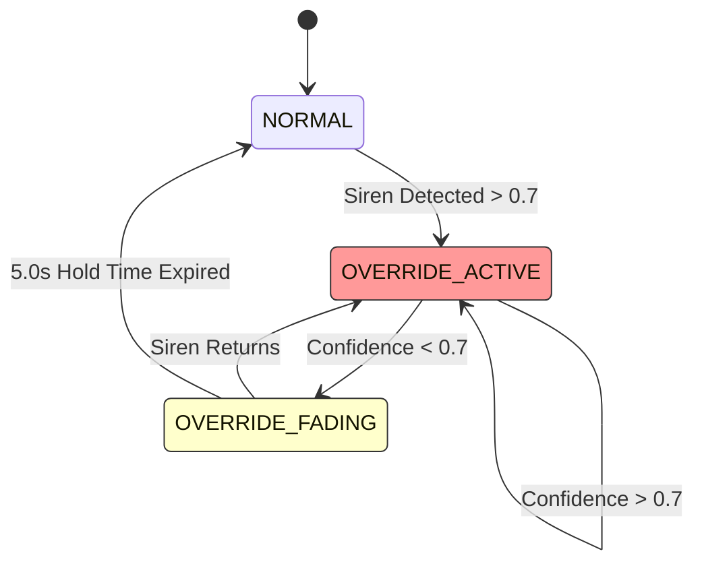

# 🧠 System Logic - Decisions & Profiles

> [!TIP]
> This module acts as the "Brain" of the application, translating raw AI detections into user-facing profile changes and critical safety actions.

---

## ⚡ Quick Reference: Logic & Heuristics

| Component | Logic Pattern | Heuristic / Constants | Rationale |
| :--- | :--- | :--- | :--- |
| **`SafetyOverride`** | State Machine | `Hold: 5.0s, Thresh: 0.7` | Prevents audio from "snapping" back to silent when a siren is still nearby. |
| **`AutoController`** | Hysteresis | `Min Diff: 0.1` | Prevents the system from "oscillating" between two similar profiles. |
| **`ControlEngine`** | Efficiency skip | `RMS < 0.01` | Skips expensive 400ms inference if the room is silent. |
| **`ProfileManager`** | Persistence | `platformdirs` | Ensures user profiles survive app updates and OS reinstalls. |

---

## 🛡️ Safety State Machine

Critical sounds (Sirens, Alarms) have absolute priority. Even if the user requests 100% noise suppression, the Safety logic will "Duck" the speakers and let the alert through.

---

## 📂 Component Deep Dive

### [control_engine.py](file:///c:/SoftwareProjects/TSEBP2025/desktop/src/profiles/control_engine.py)
*   **Method**: `process_audio_optimization()`
*   **Logic**: 
    1. Check for **Silence** (`RMS < 0.01`).
    2. Check for **Passthrough** (All gains > 0.99).
*   **Why**: Running Waveformer on a 3-second buffer every few hundred milliseconds consumes ~15-30% CPU. If there is no sound to clean, we skip the work to save battery.

### [auto_controller.py](file:///c:/SoftwareProjects/TSEBP2025/desktop/src/profiles/auto_controller.py)
*   **Method**: `should_switch_profile()`
*   **Heuristic**: `(new_confidence - current_confidence) > 0.1`
*   **Why**: If two profiles ("Office" and "Coffee Shop") have nearly identical detection triggers, YAMNet might flip-flop between them. The **10% Hysteresis** margin ensures we only switch if we are significantly more confident in the new environment.

### [safety_override.py](file:///c:/SoftwareProjects/TSEBP2025/desktop/src/profiles/safety_override.py)
*   **Method**: `apply_override()`
*   **Logic**: Boosts `events` to 1.0 and ducks `speech/noise` to 0.2.
*   **Why**: If you are wearing headphones with the mixer at max suppression, you might miss a smoke alarm. This method "cuts through" the suppression to ensure survival sounds are audible.

---

> [!WARNING]
> **Performance Note**: The `ControlEngine` runs on the UI thread main loop. Never perform heavy file I/O or model inference here; delegate that to `AudioProcess`.
