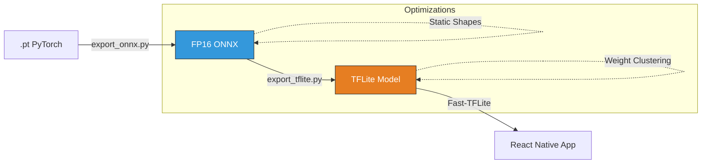

# 📱 Export & Mobile - Edge Deployment

> [!IMPORTANT]
> Porting a 100MB+ PyTorch model to a mobile device requires aggressive quantization and strict input shape management to utilize GPU/NPU acceleration.

---

## ⚡ Quick Reference: Deployment Heuristics

| Component | Logic Pattern | Heuristic / Constants | Rationale |
| :--- | :--- | :--- | :--- |
| **`ONNXExporter`** | Static Shape | `132,300 samples` | Mobile TFLite delegates (GPU/NPU) require fixed buffers; dynamic shapes trigger slow CPU fallback. |
| **`InferenceService`** | Chunked Processing | `3.0s segments` | Prevents RAM exhaustion; mobile devices can't hold a full 3-minute WAV in memory during inference. |
| **`wavUtils`** | Header Injection | `RIFF PCM 32-bit` | Manually reconstructs valid WAV metadata for processed PCM buffers. |
| **`onnx2tf`** | Converter Op | `opset 17` | Standard TensorFlow converters fail on complex signal processing ops; `onnx2tf` provides better mapping. |

---

## 🔗 Deployment Pipeline

The path from a Python training script to a React Native app:

---

## 📂 Component Deep Dive

### [export_onnx.py](../../../ai/export/export_onnx.py)
*   **The "Static Shape" Constraint**:
    - **Logic**: We hard-export the model with exactly `44100 * 3` samples.
    - **Why**: While PyTorch is flexible, mobile hardware accelerators (like Apple's CoreML or Android's NNAPI) are optimized for "Static Graphs". If the input size changes every time, the hardware must re-allocate memory, destroying real-time performance.
*   **Boundary Update**:
    - Export scripts now import model runtime from `ai/ai_runtime/separation/`.

### [WaveformerInferenceService.ts](../../../mobile-test/services/WaveformerInferenceService.ts) (Mobile)
*   **The "Chunked Inference" Strategy**:
    - **Logic**: Audio is sliced into 3-second blocks. Each block is processed, then the resulting PCM data is appended to a staging file.
    - **Why**: A 10-minute recording can be 100MB. Attempting to run deep learning on that all at once would crash most mobile apps with an **OOM (Out of Memory)** error.

### [useSuppressionDemo.ts](../../../mobile-test/hooks/useSuppressionDemo.ts) (Mobile)
*   **Logic**: Manages the the `ready` -> `recording` -> `processed` UI state. 
*   **Safety**: Uses the RMS energy of the recording to provide a visual "Waveform" to the user, ensuring they know the mic is actually working before they start the heavy processing task.

---

> [!NOTE]
> **FP16 Quantization**: We use Half-Precision (FP16) instead of INT8. While INT8 is smaller, it often creates "metallic" distortion in audio. FP16 offers a perfect balance: 2x speedup and 2x smaller size with **identical** audio quality to the original PyTorch model.
